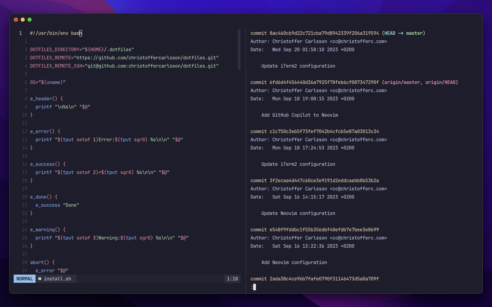

# dotfiles

Configuration files and scripts for my development environment on macOS & Linux.

## Install on macOS

> [!WARNING]\
> Running the commands below may overwrite your existing configuration files.

Open the Terminal app and run the following command:

### Step 1 - Run installation script

```bash
/bin/bash -c "$(curl -fsSL https://raw.githubusercontent.com/christoffercarlsson/dotfiles/HEAD/install.sh)"
```

The installation script will start by downloading and installing
[Homebrew](https://brew.sh) onto your system (if you don't already have it
installed). Then, the apps and utilities listed in the
[Brewfile](./homebrew/Brewfile) will be installed and configured.

### Step 2 - Launch iTerm2

After you've run the command listed above, quit the Terminal app and launch
iTerm2 for all changes to take effect.

### Step 3 - Enter your Git credentials (optional)

Run the following command to configure your Git credentials:

```bash
set-git-author
```

Enter the name and email address that you want to associate your Git commits
with. The script will then attempt to import your PGP public key from a
keyserver automatically based on your email address (if your public key is not
found on a keyserver you'll need to import it manually).

### Step 4 - Enter your NPM access token (optional)

If you are publishing NPM packages to registry.npmjs.com, or to GitHub Packages,
you can set your access tokens in the `~/.bash_profile` file by editing the
`NPM_AUTH_TOKEN` and `NPM_AUTH_TOKEN_GITHUB` values, respectively.

## Updating and keeping configurations in sync across devices

The installation script will clone this Git repository into the `~/.dotfiles`
directory. From there, keeping common configuration in sync across different
machines is done by commiting and pushing the changes to the remote repository
specified by the `DOTFILES_REMOTE_SSH` value defined at the top of the
`install.sh` file.

By updating the location of the installation script in
[Step 1](#step-1---run-installation-script) above, setting the
`DOTFILES_REMOTE_SSH` value in `install.sh` and running the
`git remote set-url origin <your-repo-url>` command you can easily keep your own
copy and version history of these dotfiles in sync across your devices.

## License

These dotfiles are licensed under [The Unlicense](./LICENSE).
